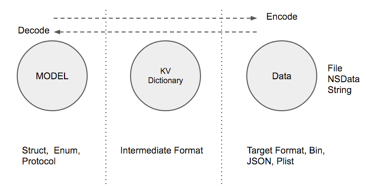
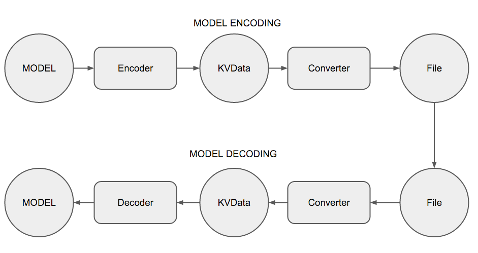

#State

A Swift model framework that supports `structs`, `enums` and `protocols` in the model layer. Models optionally can be defined just like with Core Data, using [Xcode's Core Data model design tool](https://developer.apple.com/library/ios/recipes/xcode_help-core_data_modeling_tool/Articles/about_cd_modeling_tool.html#//apple_ref/doc/uid/TP40010379-CH3-SW1). Model code is  generated automatically using [Mogenerator](https://github.com/rentzsch/mogenerator). The framework provides serialization to and from Plists, JSON, or Binary.
                                                                                                                                                                                                                                                   
####Features: 

- Design Models just like Core Data, in the Xcode model designer
- Model code generated automatically
- Struct, Enum (including associated types), and Protocol model types supported.
- Use immutable, optional, and non-optional properties
- Read and write models to and from JSON, Plists, and Binary 
- Model versioning and migration management (optional)

For more information on the benfiets of State read [About State](Docs/About.md)

#### Example:
Whether you use the data modeler and code generation, or you code your models by hand, it is very easy to define models with State.
This is a complete model as it would be generated, or defined by hand. The example shows you can have constants, optionals, and composition of other models.

```swift
public struct MyModel : Model {
    public let myDate: NSDate
    public let myArrayOfStrings: [String]
    public var myBinary: NSData?
    public var myOtherModel: MyOtherModel
    public var myModelCollection: [MyOtherModel]
}

extension MyModel : Decodable {
    public init?(var decoder: Decoder) {
        // use guard for non-optionals
        guard
            let myDate: NSDate = decoder.decode("myDate"),
            let myArrayOfStrings = decoder.decode("myArrayOfStrings"),
            let myOtherModel: MyOtherModel = decoder.decodeModel("myOtherModel"),
            let myModelCollection: [MyOtherModel] = decoder.decodeModelArray("myModelCollection"),
        else { return  nil }
        let myBinary: NSData = decoder.decode("myBinary")

        self.myDate = myDate
        self.myArrayOfStrings = myArrayOfStrings
        self.myBinary = myBinary
        self.myOtherModel = myOtherModel
        self.myModelCollection = myModelCollection
    }
}

extension MyModel : Encodable {
    public func encode(encoder: Encoder) {
        encoder.encode(myDate, "myDate")
        endcoder.encode(myArrayOfStrings, "myArraryOfStrings")
        encoder.encode(myBinary, "myBinary")
        encoder.encode(myOtherModel, "myOtherModel")
        encoder.encode(myModelCollection, "myModelCollection")
    }
}

```

## Protocol Oriented
State has a protocol oriented design with extension points to extend all of your models.
Model items can compose with protocol types with full serialization support.


Not only can you extend each individual model type with an extension, you can also add API to all of your model elements by extending the Model protocol with your own protocol extension. In-fact, this is exactly how State provides a save function to every model.


## Serialization
Convenient serialization API is provided with the  `save` function by passing in the format, and the path. Load models using an initializer that takes the format and the path.

#### Saving and loading models to a file
```swift

// JSON
model.save(.JSON, path: "model.json")
let model = ModelType(.JSON, path: "model.json")

// Plist
model.save(.Plist, path: "model.plist")
let model = ModelType(.Plist, path: "model.plist")
```

## General Design Philosophy 
The encoding and decoding process is decoupled from the data conversion format. All models are encoded and decoded to an intermediate Key-Value dictionary. The Key-Value data is then either decoded into a model, or converted to a target format (bin, plist, json).



# [ Read the Documentation to Get Started](Docs/)

##System Requirements
- Swift 2.0
- Xcode 7.0
- iOS 8.0
- Mogenerator 1.28

## License

State is released under the MIT license. See
[LICENSE.md](https://github.com/STLabs/State/blob/master/LICENSE).
